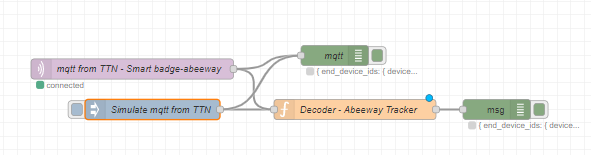

<!-- PROJECT LOGO -->
<br />
<p align="center">
  <a href="https://github.com/JohanScheepers/TTN-Node-Red-Decoder">
    
  </a>

  <h3 align="center"> TTN-Node-Red-Decoder </h3>

  <p align="center">
    Project is aimed to use the Node-Red to decode TTN raw data
    <br />
    <a href="https://github.com/JohanScheepers/TTN-Node-Red-Decoder"><strong>Explore the docs »</strong></a>
    <br />
    <br />
    <a href="https://github.com/JohanScheepers/TTN-Node-Red-Decoder/blob/main/images/gatewayRadius.gif">View Demo</a>
    ·
    <a href="https://github.com/JohanScheepers/TTN-Node-Red-Decoder/issues">Report Bug</a>
    ·
    <a href="https://github.com/JohanScheepers/TTN-Node-Red-Decoder/issues">Request Feature</a>
  </p>
</p>


<!-- TABLE OF CONTENTS -->
<details open="open">
  <summary><h2 style="display: inline-block">Table of Contents</h2></summary>
  <ol>
    <li>
      <a href="#about-the-project">About The Project</a>
      <ul>
        <li><a href="#built-with">Built With</a></li>
      </ul>
    </li>
    <li>
      <a href="#getting-started">Getting Started</a>
      <ul>
        <li><a href="#prerequisites">Prerequisites</a></li>
        <li><a href="#installation">Installation</a></li>
      </ul>
    </li>
    <li><a href="#usage">Usage</a></li> 
    <li><a href="#roadmap">Roadmap</a></li>
    <li><a href="#license">License</a></li>
    <li><a href="#contact">Contact</a></li>
  </ol>
</details>


<!-- ABOUT THE PROJECT -->
## About The Project

In this project we are going to explore how to decode raw data from The Things Stack Community Edition applications we have created. In this example we cannot use the decoder in The Things Stack Community Edition as the decoder is larger than 4k, but you can use this on any size decoder.


` TTN Node Red Decoder`


### Built With

* []()Node-Red


<!-- GETTING STARTED -->
## Getting Started

To get a local copy up and running follow these simple steps.

### Prerequisites

* Node-Red
  ```sh
  https://nodered.org/docs/getting-started/
  ```


### Installation

 Install Node-Red following the relevant getting started guide for your operating system form the official website
   ```sh
   https://nodered.org/docs/getting-started/
   ```


<!-- USAGE EXAMPLES -->
## Usage

I have some Abeeway Smart barges and micro trackers, the decoder for them are more the 4k so you can’t utilize the decoder on the “The Things Stack Community Edition”, here I am going to use Node-Red to decode the raw data for me. In the same way you can use the decoder for both small and large packet decoders.

1. Create your application in TTN, add you device to the application.
 


2. In the integration add MQTT , copy your “Public TLS address”, “Username” and “Generate new API key”


3. Head over to  your Node-Red instance and add a MQTT node to your flow, set up using https://www.thethingsnetwork.org/forum/t/mqtt-in-node-red-howto/39909


4. Add a “function” node and some “debug” nodes (these are just for debug purposes) and wire the lot together. I have an additional “inject” node just to simulate the JSON from TTN.



5. In the “inject” node (Simulate mqtt from TTN) you can past the below (remember this is the JSON from TTN for an Abeeway tracker) in the msg.payload, you also need to change the payload type to JSON. The structure from TTN are the same for all nodes. And then select “Done”. ``` {"topic":"v3/smart-badge@ttn/devices/sotracking-abeeway-smartbadge-1/up","payload":{"end_device_ids":{"device_id":"sotracking-abeeway-smartbadge-1","application_ids":{"application_id":"smart-badge"},"dev_eui":"ttnPacketSim","join_eui":"ttnPacketSim2","dev_addr":"ttnPacketSim3"},"correlation_ids":["as:up:01FATZDBM2VGCRW537A405259N","gs:conn:01FAT7G51B7H8S9T0QEVGGD3BA","gs:up:host:01FAT7G51H1EMBX5QSFCMJR05S","gs:uplink:01FATZDBD5TRMD7VMF7BMJKDY6","ns:uplink:01FATZDBDK2H1BA0WPZTW3C5B1","rpc:/ttn.lorawan.v3.GsNs/HandleUplink:01FATZDBDK6RVCXGG0J440347E","rpc:/ttn.lorawan.v3.NsAs/HandleUplink:01FATZDBM2EFSJX03FHV7F3E97"],"received_at":"2021-07-17T19:34:40.516171594Z","uplink_message":{"session_key_id":"AXpDcMNiQiGwLWFsBx2pYQ==","f_port":18,"f_cnt":2292,"frm_payload":"BSAUeKBAAgEBAwIC","rx_metadata":[{"gateway_ids":{"gateway_id":"on-the-hill-01","eui":"00800000A000104F"},"timestamp":4101298211,"rssi":-65,"channel_rssi":-65,"snr":10.2,"location":{"latitude":-29.79981320234865,"longitude":30.762821694859166,"source":"SOURCE_REGISTRY"},"uplink_token":"ChwKGgoOb24tdGhlLWhpbGwtMDESCACAAACgABBPEKOw06MPGgwI0OHMhwYQnuz1hgEguJGxw67oBQ==","channel_index":3}],"settings":{"data_rate":{"lora":{"bandwidth":125000,"spreading_factor":7}},"data_rate_index":5,"coding_rate":"4/5","frequency":"867100000","timestamp":4101298211},"received_at":"2021-07-17T19:34:40.307703855Z","consumed_airtime":"0.066816s","version_ids":{"brand_id":"abeeway","model_id":"abeeway-smart-badge","hardware_version":"1.0","firmware_version":"2.1","band_id":"EU_863_870"}}},"qos":0,"retain":false,"_msgid":"cb67353f.d8bfa8"} ```

 

6. In the “function” node, change the name to “Decoder - Abeeway Tracker” and past the bellow in the “On Message” tab. 
```
let bytes = Buffer.from(msg.payload.uplink_message.frm_payload)

let decoded = context.Decoder(bytes, msg.payload.uplink_message.f_port)
msg.payload.uplink_message.decoded_payload = decoded
return msg
```


7. In the “On Start” tab is where we are pasting our “decoder” (replace with you own decoder for other applications, remember this is for Abeeway and only will work with them) , for the Abeeway is the code below and select done and we can “deploy” the flow

```
abeeway code
```
 


8. No if we press the button on the “” your test JSON is injected and you date is decoded.
 


9. If you receive an Uplink from you Abeeway tracker it will also be decoded.

10. The raw data resides in “msg.payload.uplink_message.frm_payload “


11. Your decode data resides in “msg.payload.uplink_message.decoded_payload” \


<!-- ROADMAP -->
## Roadmap

See the [open issues](https://github.com/JohanScheepers/TTN-Node-Red-Decoder/issues) for a list of proposed features (and known issues).


<!-- LICENSE -->
## License

Distributed under the MIT License. See `LICENSE` for more information.


<!-- CONTACT -->
## Contact


Project Link: [https://github.com/JohanScheepers/TTN-Node-Red-Decoder](https://github.com/JohanScheepers/TTN-Node-Red-Decoder)


<!-- MARKDOWN LINKS & IMAGES -->
<!-- https://www.markdownguide.org/basic-syntax/#reference-style-links -->

[forks-shield]: https://img.shields.io/github/forks/JohanScheepers/repo.svg?style=for-the-badge
[forks-url]: https://github.com/JohanScheepers/repo/network/members
[stars-shield]: https://img.shields.io/github/stars/JohanScheepers/repo.svg?style=for-the-badge
[stars-url]:https://github.com/JohanScheepers/TTN-Node-Red-Decoder/stargazers
[issues-shield]: https://img.shields.io/github/issues/JohanScheepers/repo.svg?style=for-the-badge
[issues-url]: https://github.com/JohanScheepers/repo/issues
[license-shield]: https://img.shields.io/github/license/JohanScheepers/repo.svg?style=for-the-badge
[license-url]: https://github.com/JohanScheepers/repo/blob/master/LICENSE.txt
[linkedin-shield]: https://img.shields.io/badge/-LinkedIn-black.svg?style=for-the-badge&logo=linkedin&colorB=555
[linkedin-url]: https://www.linkedin.com/in/johan-scheepers-6a263514a/

